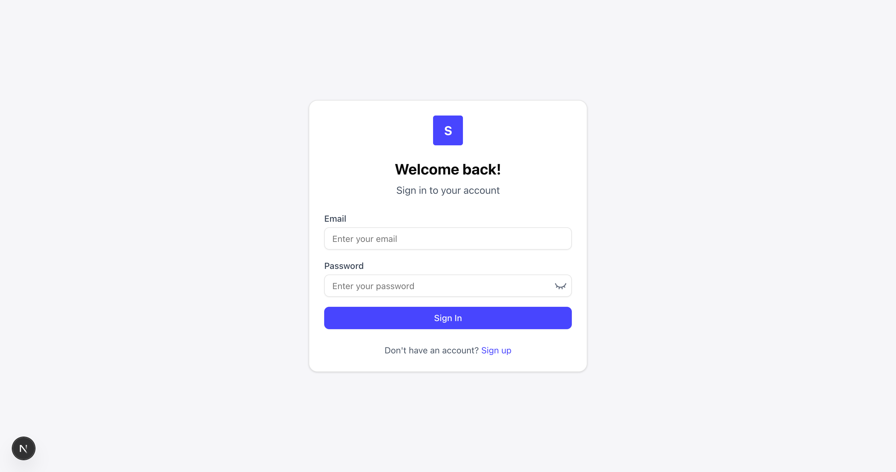
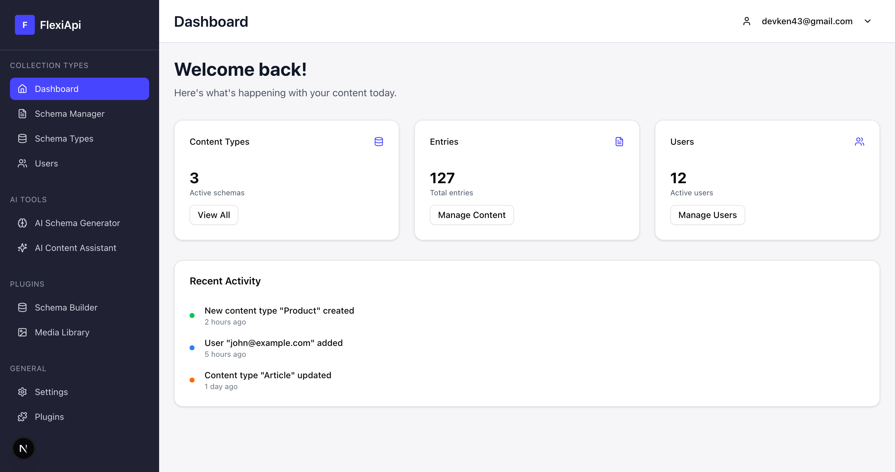
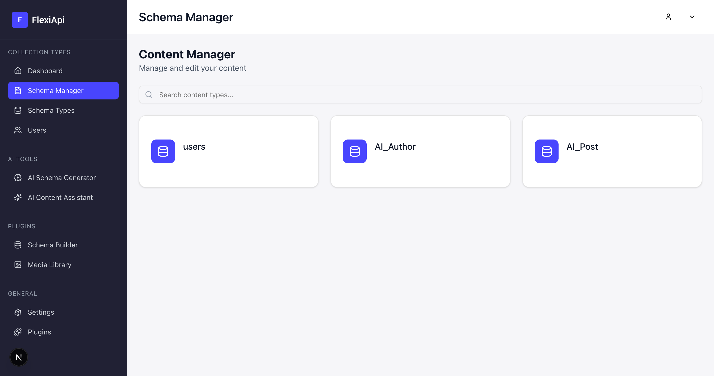
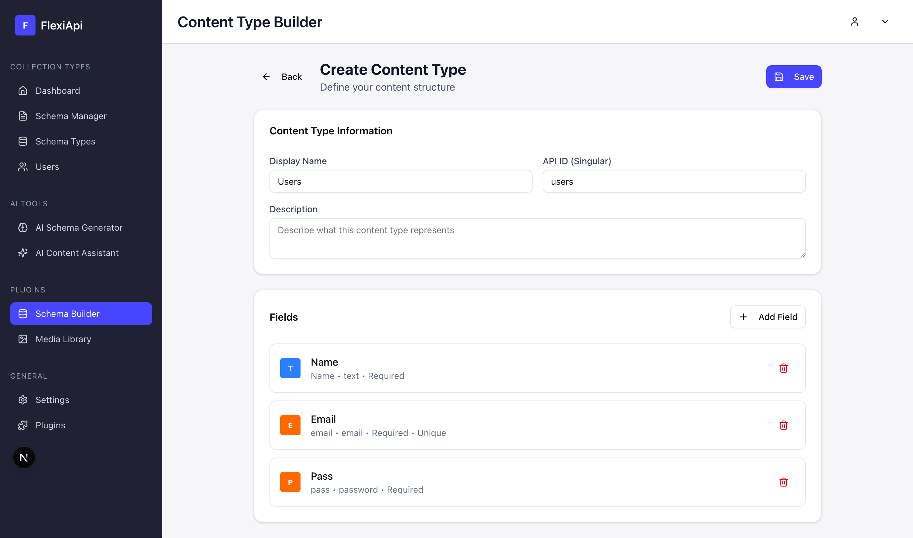
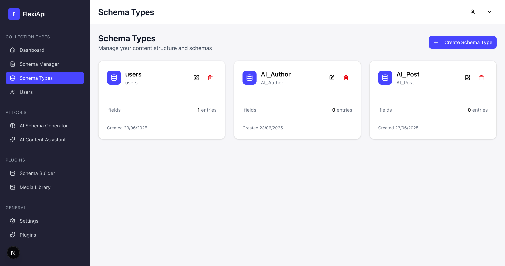
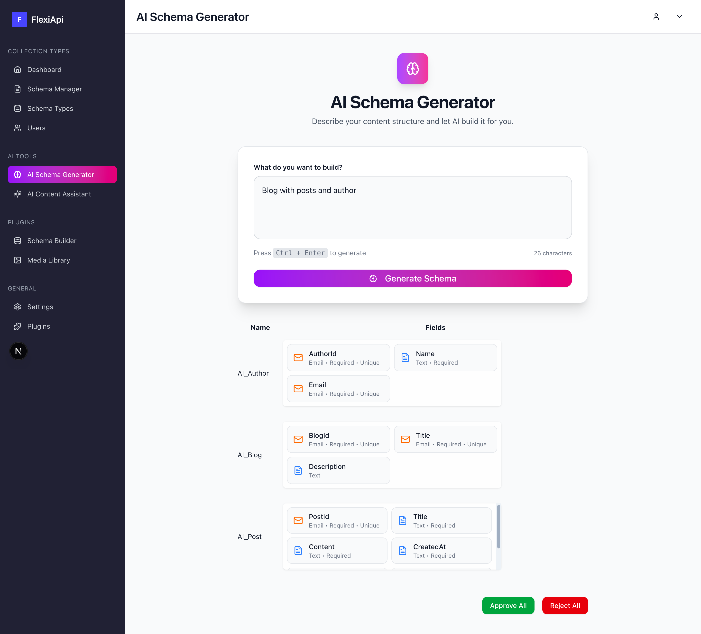

# FlexApp

FlexApp is a powerful and flexible application designed to streamline content management and schema generation. It combines a robust backend built with Spring Boot and a dynamic frontend powered by Next.js to deliver a seamless user experience.

## Features
- **Versioning of DB**: Just like git but for databases(data and structure).
- **Dynamic API Generation**: Just create architecture it will generate endpoints.
- **AI Architecture**: Generate scalable and complex architecture
- **Delegated API**: User can delegate api acess. 

## Tech Stack

### Frontend
- **Framework**: Next.js
- **Language**: TypeScript
- **Styling**: CSS Modules

### Backend
- **Framework**: Spring Boot
- **Language**: Java
- **Database**: PostgreSQL
- **Authentication**: JWT

## Installation and Setup

### Frontend
1. Navigate to the `flexapi` directory:
   ```bash
   cd flexapi
   ```
2. Install dependencies:
   ```bash
   npm install
   ```
3. Start the development server:
   ```bash
   npm run dev
   ```
4. Open [http://localhost:3000](http://localhost:3000) in your browser.

### Backend
1. Navigate to the `flexApi-backend` directory:
   ```bash
   cd flexApi-backend
   ```
2. Build the project:
   ```bash
   ./mvnw clean install
   ```
3. Run the application:
   ```bash
   ./mvnw spring-boot:run
   ```
4. The backend server will be available at [http://localhost:8080](http://localhost:8080).

## Usage Instructions

1. **Login/Signup**: Access the authentication pages to create an account or log in.
2. **Content Management**: Navigate to the dashboard to manage content types and entries.
3. **Schema Generation**: Use the schema generator to create and update schemas dynamically.
4. **API Documentation**: Explore the integrated API documentation for backend endpoints.

## Contribution Guidelines

We welcome contributions to FlexApp! Please follow these steps:
1. Fork the repository.
2. Create a new branch for your feature or bug fix.
3. Submit a pull request with a detailed description of your changes.

## Screenshots

Here are some screenshots showcasing the application's features:

### Login Page


### Dashboard


### Schema Management


### Manual Schema Builder


### Schema Types


### AI Schema Generator



## License

FlexApp is licensed under the MIT License. See the [LICENSE](LICENSE) file for details.
